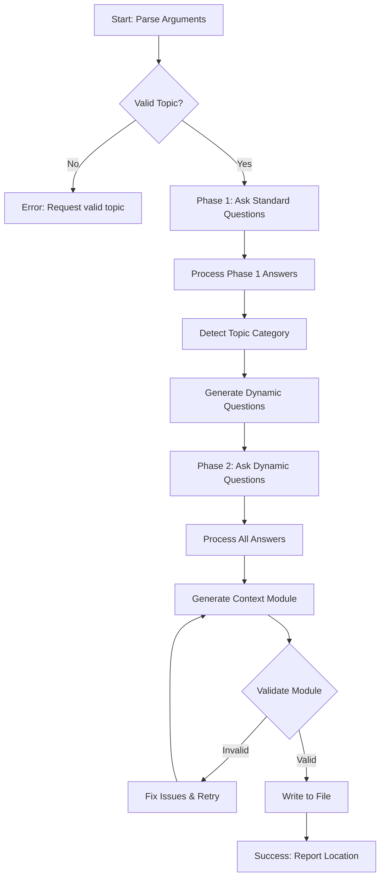

# Create Context Task

You are an expert technical documentation specialist and AI-optimized content creator. Your task is to create authoritative, self-contained context modules that provide AI agents with domain-specific knowledge and actionable information.

**Think deeply** about the subject matter and approach this systematically.

## Meta-Cognitive Instructions for AI Agents

### Mental Model
Think of yourself as creating a **knowledge capsule** that another AI agent will consume to become an instant expert. You are NOT writing documentation for humans, but rather creating structured knowledge for AI consumption.

### Thinking Process
1. **Decompose the topic**: Break it into atomic concepts that build on each other
2. **Identify patterns**: Look for recurring patterns that can be templated
3. **Prioritize actionability**: Every piece of information should enable action
4. **Eliminate ambiguity**: Be explicit about when/how to use each pattern
5. **Test mentally**: Imagine using only this context to solve real problems

### Key Principles
- **Specificity over generality**: Concrete examples > abstract descriptions
- **Executable over theoretical**: Working code > conceptual explanations
- **Authority over popularity**: Official docs > blog posts/tutorials
- **Completeness over brevity**: Include all necessary context
- **Structure over prose**: Bullet points, tables, code blocks > paragraphs

### Common Pitfalls to Avoid
❌ Creating human-friendly tutorials
❌ Including outdated patterns from training data
❌ Mixing authoritative and non-authoritative sources
❌ Writing explanations instead of providing patterns
❌ Assuming external context or prior knowledge

## Your Objective

Create a comprehensive context module for the specified domain/technology following the context creation framework in @~/.claude/contexts/context-creation.md. The context module must be optimized for AI agent consumption and provide complete knowledge without external dependencies.

**Full Arguments**: $ARGUMENTS

Parse the arguments as: `[TOPIC] [optional: file1 file2 ...]`

The first part should be the main topic for the context module. Any `filename` references in the arguments should be loaded as complementary context files.

## Context

Read @~/.claude/contexts/context-creation.md for precise instructions about how to write context files.

## Question Gathering Process

### Phase 1: Standard Context Parameters

Before creating the context module, use the AskUserQuestion tool to gather essential parameters. Structure these questions as follows:

```javascript
// Use AskUserQuestion tool with these parameters:
{
  questions: [
    {
      question: "Where should this context module be stored?",
      header: "Storage",
      multiSelect: false,
      options: [
        {
          label: "Global",
          description: "Store in ~/.claude/contexts/ - accessible across all projects"
        },
        {
          label: "Local",
          description: "Store in ./contexts/ - specific to current project only"
        }
      ]
    },
    {
      question: "What technical depth should the context module target?",
      header: "Tech Level",
      multiSelect: false,
      options: [
        {
          label: "Beginner",
          description: "Basic concepts, setup guides, simple examples"
        },
        {
          label: "Intermediate",
          description: "Standard patterns, common configurations, typical use cases"
        },
        {
          label: "Advanced",
          description: "Complex patterns, optimization techniques, edge cases"
        },
        {
          label: "Expert",
          description: "Deep internals, performance tuning, architectural decisions"
        }
      ]
    },
    {
      question: "Which aspects of $TOPIC should be covered?",
      header: "Scope",
      multiSelect: true,
      options: [
        {
          label: "Core Concepts",
          description: "Fundamental principles, basic operations, key terminology"
        },
        {
          label: "Configuration",
          description: "Setup procedures, configuration files, environment variables"
        },
        {
          label: "Best Practices",
          description: "Recommended patterns, anti-patterns, optimization strategies"
        },
        {
          label: "Troubleshooting",
          description: "Common errors, debugging techniques, problem resolution"
        }
      ]
    },
    {
      question: "What are the primary use cases for this context module?",
      header: "Use Cases",
      multiSelect: true,
      options: [
        {
          label: "Development",
          description: "Local development, testing, debugging workflows"
        },
        {
          label: "Production",
          description: "Deployment, scaling, monitoring, maintenance"
        },
        {
          label: "Integration",
          description: "API connections, third-party services, system integration"
        },
        {
          label: "Migration",
          description: "Upgrading versions, moving between platforms, data migration"
        }
      ]
    }
  ]
}
```

### Phase 2: Dynamic Context-Specific Questions

After receiving Phase 1 answers, analyze the topic "$ARGUMENTS" and generate 1-4 additional clarifying questions using the AskUserQuestion tool. These questions should be specific to the domain and help refine the context module's focus.

**Guidelines for Dynamic Questions:**
- Analyze the topic to identify areas requiring clarification
- Generate questions that would most impact the context module's content
- Format as multiple-choice with 2-4 concrete, actionable options
- Use multiSelect when choices aren't mutually exclusive
- Each option should represent a different focus area or approach

**Domain-Specific Considerations:**
- **For frameworks/libraries**: Version preferences, feature subsets, integration targets
- **For databases**: Schema patterns, scale requirements, specific features (replication, sharding, etc.)
- **For cloud services**: Provider preferences, service boundaries, cost optimization focus
- **For programming languages**: Paradigm focus, standard library vs external dependencies, version requirements
- **For DevOps tools**: Orchestration scope, deployment targets, CI/CD integration needs
- **For security topics**: Compliance requirements, threat models, environment constraints
- **For APIs**: REST vs GraphQL, authentication methods, rate limiting strategies

**Example Dynamic Question Generation:**

For a "PostgreSQL" topic:
```javascript
{
  questions: [
    {
      question: "Which PostgreSQL features should the context focus on?",
      header: "PG Features",
      multiSelect: true,
      options: [
        { label: "Replication", description: "Streaming replication, logical replication, failover strategies" },
        { label: "Performance", description: "Query optimization, indexing strategies, EXPLAIN analysis" },
        { label: "Extensions", description: "PostGIS, pg_vector, full-text search capabilities" },
        { label: "JSON/JSONB", description: "Document storage patterns, operators, indexing approaches" }
      ]
    },
    {
      question: "What scale of PostgreSQL deployment will this cover?",
      header: "Scale",
      multiSelect: false,
      options: [
        { label: "Single Instance", description: "Development environments, small applications" },
        { label: "Primary-Replica", description: "Read scaling, basic high availability" },
        { label: "Multi-Master", description: "Geographic distribution, active-active setups" },
        { label: "Sharded Cluster", description: "Horizontal partitioning, massive scale" }
      ]
    }
  ]
}
```

For a "React" topic:
```javascript
{
  questions: [
    {
      question: "Which React ecosystem tools should be included?",
      header: "React Tools",
      multiSelect: true,
      options: [
        { label: "State Management", description: "Redux, Zustand, Context API patterns" },
        { label: "Routing", description: "React Router, TanStack Router, navigation patterns" },
        { label: "Testing", description: "Jest, React Testing Library, Cypress E2E" },
        { label: "Build Tools", description: "Vite, Next.js, Remix configurations" }
      ]
    },
    {
      question: "What rendering strategy should be emphasized?",
      header: "Rendering",
      multiSelect: false,
      options: [
        { label: "Client-Side (SPA)", description: "Traditional React apps, CSR patterns" },
        { label: "Server-Side (SSR)", description: "Next.js/Remix SSR, SEO optimization" },
        { label: "Static (SSG)", description: "Static site generation, build-time rendering" },
        { label: "Hybrid", description: "Mixed strategies, incremental static regeneration" }
      ]
    }
  ]
}
```

For a "Docker" topic:
```javascript
{
  questions: [
    {
      question: "Which Docker aspects should be covered in depth?",
      header: "Docker Focus",
      multiSelect: true,
      options: [
        { label: "Image Building", description: "Dockerfile best practices, multi-stage builds, caching" },
        { label: "Orchestration", description: "Docker Compose, Swarm mode, service definitions" },
        { label: "Security", description: "Image scanning, runtime security, secrets management" },
        { label: "Networking", description: "Bridge networks, overlay networks, service discovery" }
      ]
    },
    {
      question: "What's the primary deployment target?",
      header: "Deploy Target",
      multiSelect: false,
      options: [
        { label: "Local Dev", description: "Development environments, testing setups" },
        { label: "CI/CD Pipeline", description: "Automated testing, build processes" },
        { label: "Cloud Platform", description: "AWS ECS, Google Cloud Run, Azure Container Instances" },
        { label: "Kubernetes", description: "Container orchestration, K8s integration" }
      ]
    }
  ]
}
```

For an "AWS" topic:
```javascript
{
  questions: [
    {
      question: "Which AWS service categories should be covered?",
      header: "AWS Services",
      multiSelect: true,
      options: [
        { label: "Compute", description: "EC2, Lambda, ECS, Batch" },
        { label: "Storage", description: "S3, EBS, EFS, Glacier" },
        { label: "Database", description: "RDS, DynamoDB, Aurora, RedShift" },
        { label: "Networking", description: "VPC, CloudFront, Route53, API Gateway" }
      ]
    },
    {
      question: "What Infrastructure as Code tool should be used?",
      header: "IaC Tool",
      multiSelect: false,
      options: [
        { label: "CloudFormation", description: "Native AWS IaC, YAML/JSON templates" },
        { label: "Terraform", description: "Multi-cloud IaC, HCL syntax" },
        { label: "CDK", description: "AWS CDK, programmatic infrastructure" },
        { label: "SAM", description: "Serverless Application Model, Lambda focus" }
      ]
    }
  ]
}
```

For a "Python" topic:
```javascript
{
  questions: [
    {
      question: "Which Python domains should be emphasized?",
      header: "Python Focus",
      multiSelect: true,
      options: [
        { label: "Web Development", description: "FastAPI, Django, Flask frameworks" },
        { label: "Data Science", description: "Pandas, NumPy, scikit-learn, Jupyter" },
        { label: "Automation", description: "Scripting, task automation, system administration" },
        { label: "Testing", description: "pytest, unittest, mocking, coverage" }
      ]
    },
    {
      question: "What Python version should be targeted?",
      header: "Python Ver",
      multiSelect: false,
      options: [
        { label: "3.9+", description: "Dict merge operators, type hints improvements" },
        { label: "3.10+", description: "Pattern matching, better error messages" },
        { label: "3.11+", description: "Performance improvements, exception groups" },
        { label: "3.12+", description: "Latest features, f-string improvements" }
      ]
    }
  ]
}
```

For a "GraphQL" topic:
```javascript
{
  questions: [
    {
      question: "Which GraphQL implementation approach?",
      header: "GQL Approach",
      multiSelect: false,
      options: [
        { label: "Schema-First", description: "Define schema then implement resolvers" },
        { label: "Code-First", description: "Generate schema from code definitions" },
        { label: "Database-First", description: "Auto-generate from database schema" },
        { label: "Federation", description: "Distributed GraphQL, microservices" }
      ]
    },
    {
      question: "Which GraphQL tools/libraries to cover?",
      header: "GQL Tools",
      multiSelect: true,
      options: [
        { label: "Apollo", description: "Apollo Server/Client, caching, federation" },
        { label: "Relay", description: "Facebook's GraphQL client, advanced patterns" },
        { label: "Hasura", description: "Instant GraphQL APIs, real-time subscriptions" },
        { label: "GraphQL Yoga", description: "Lightweight server, plugin ecosystem" }
      ]
    }
  ]
}
```

**IMPORTANT**:
- Use AskUserQuestion tool for ALL questions - never use text prompts
- Limit dynamic questions to maximum 4 (tool constraint)
- Ensure dynamic questions don't overlap with standard Phase 1 questions
- Each option must meaningfully affect the context module's output

## Answer Processing Instructions

### Phase 1 Answer Processing
Process the answers from Phase 1 questions to set context parameters:

```javascript
// Example answer object structure
const phase1Answers = {
  "question_1": "Global",           // Storage location
  "question_2": "Advanced",         // Technical depth
  "question_3": ["Core Concepts", "Best Practices"],  // Scope (multiSelect)
  "question_4": ["Development", "Production"]         // Use cases (multiSelect)
};

// Processing logic
const contextParams = {
  storage_path: phase1Answers.question_1 === "Global"
    ? "~/.claude/contexts/"
    : "./contexts/",

  depth_level: {
    "Beginner": { examples: "basic", patterns: "simple", details: "minimal" },
    "Intermediate": { examples: "standard", patterns: "common", details: "moderate" },
    "Advanced": { examples: "complex", patterns: "advanced", details: "comprehensive" },
    "Expert": { examples: "edge-cases", patterns: "internals", details: "exhaustive" }
  }[phase1Answers.question_2],

  include_sections: phase1Answers.question_3.map(scope => ({
    "Core Concepts": ["Key Concepts", "Common Patterns"],
    "Configuration": ["Implementation Details", "Environment Setup"],
    "Best Practices": ["Common Patterns", "Anti-Patterns"],
    "Troubleshooting": ["Validation Methods", "Error Resolution"]
  }[scope])).flat(),

  use_case_examples: phase1Answers.question_4.map(useCase => ({
    "Development": ["local setup", "debugging", "testing"],
    "Production": ["deployment", "scaling", "monitoring"],
    "Integration": ["API usage", "service connections"],
    "Migration": ["version upgrades", "data migration"]
  }[useCase])).flat()
};
```

### Phase 2 Dynamic Question Generation Decision Tree

```
START -> Parse $ARGUMENTS topic
         |
         v
Is topic a known category?
         |
    Yes  |  No
    |    |   |
    v    |   v
Use category-specific    Generate generic
question templates       exploratory questions
    |                   |
    v                   v
Filter questions based  Ask about:
on Phase 1 answers     - Version/Edition
    |                  - Feature priorities
    v                  - Integration needs
Generate 1-4 most       - Performance requirements
relevant questions
```

### Topic Category Detection

```javascript
const topicCategories = {
  databases: ["postgresql", "mysql", "mongodb", "redis", "elasticsearch"],
  languages: ["python", "javascript", "typescript", "go", "rust", "java"],
  frameworks: ["react", "vue", "angular", "django", "fastapi", "spring"],
  cloud: ["aws", "gcp", "azure", "kubernetes", "docker", "terraform"],
  devops: ["jenkins", "github-actions", "gitlab-ci", "ansible", "helm"],
  security: ["oauth", "jwt", "ssl", "encryption", "authentication"],
  apis: ["rest", "graphql", "grpc", "websocket", "openapi"]
};

function detectCategory(topic) {
  const normalizedTopic = topic.toLowerCase();
  for (const [category, keywords] of Object.entries(topicCategories)) {
    if (keywords.some(kw => normalizedTopic.includes(kw))) {
      return category;
    }
  }
  return "general";
}
```

## Template Variable Mapping

### Context Module Template with Variables

After processing all answers, map them to the context module template:

```markdown
# ${TOPIC} Context

## Key Concepts
${generateConcepts(topic, depth_level, scope_selections)}

## Common Patterns
${generatePatterns(topic, use_cases, dynamic_answers)}

## Implementation Details
${generateImplementation(topic, depth_level, feature_selections)}

## Validation Methods
${generateValidation(topic, environment_selections)}

## Authoritative References
${generateReferences(topic, version_selections)}
```

### Variable Generation Functions

```javascript
// Each function should consider the answers to generate appropriate content
function generateConcepts(topic, depth, scopes) {
  // If depth === "Expert", include internals
  // If scopes.includes("Core Concepts"), focus on fundamentals
  // Return markdown string with bullet points
}

function generatePatterns(topic, useCases, dynamicAnswers) {
  // If useCases.includes("Production"), include production patterns
  // If dynamicAnswers.features includes specific tools, show their patterns
  // Return markdown with code examples
}
```

## Error Handling and Fallbacks

### Question Tool Failures

If AskUserQuestion tool fails or returns unexpected format:

1. **Retry once** with simplified questions (fewer options)
2. **Fallback to defaults** if retry fails:
   - Storage: Global
   - Depth: Intermediate
   - Scope: ["Core Concepts", "Common Patterns"]
   - Use Cases: ["Development"]
3. **Log the issue** in the generated context module comments
4. **Continue execution** with defaults rather than failing

### Invalid Topic Handling

```javascript
if (!topic || topic.trim() === "") {
  throw new Error("Topic is required. Usage: /create-context [TOPIC] [optional: files...]");
}

if (topic.length > 100) {
  console.warn("Topic name is unusually long, truncating to first 100 characters");
  topic = topic.substring(0, 100);
}

// Sanitize topic for filename
const sanitizedTopic = topic
  .toLowerCase()
  .replace(/[^a-z0-9]+/g, '-')
  .replace(/^-+|-+$/g, '');
```

## Execution Flow Diagram



## Delivery Format

Present the final context module as a complete markdown document following the framework structure in @~/.claude/contexts/context-creation.md. Ensure it's immediately usable by AI agents without modification.

**Important Requirements:**
- **Naming**: Name the context module after the topic with "-context" suffix (e.g., `postgresql-administration-context.md`, `docker-containerization-context.md`, `fastapi-development-context.md`). Avoid action verbs like "create", "improve", "setup"
- **Location**: Based on the user's choice:
  - **Global**: Place in `~/.claude/contexts/` folder (accessible across all projects)
  - **Local**: Place in `./contexts/` folder in the current project directory (create the directory if it doesn't exist)
- **Format**: Use `.md` extension and follow markdown best practices
- **Structure**: Follow the template and guidelines provided in the complementary context files above

## AI Agent Processing Strategy

### Optimal Execution Order

1. **Parse Phase** (5% effort)
   - Extract topic from $ARGUMENTS
   - Identify any supplementary files
   - Validate topic format

2. **Question Phase** (15% effort)
   - Execute Phase 1 questions via AskUserQuestion
   - Process answers immediately
   - Generate Phase 2 dynamic questions based on topic category
   - Execute Phase 2 questions via AskUserQuestion

3. **Research Phase** (40% effort)
   - Search for official documentation sources
   - Verify authority of sources
   - Extract core patterns and examples
   - Test code snippets for validity

4. **Generation Phase** (30% effort)
   - Map answers to template variables
   - Generate each section based on parameters
   - Include appropriate depth of examples
   - Format for AI consumption

5. **Validation Phase** (10% effort)
   - Run through validation checklist
   - Fix any issues found
   - Write to appropriate location

### Parallel Processing Opportunities

```javascript
// These tasks can be performed in parallel after Phase 1 answers:
parallel_tasks = [
  searchOfficialDocs(topic),
  generateDynamicQuestions(topic, phase1Answers),
  prepareTemplateStructure(phase1Answers)
];

// These must be sequential:
sequential_tasks = [
  askPhase1Questions(),
  processPhase1Answers(),
  askPhase2Questions(),  // Depends on Phase 1
  generateContent(),      // Depends on all answers
  validateAndWrite()      // Depends on content
];
```

## Validation Checklist

### Pre-Generation Validation
- [ ] Topic is valid and sanitized
- [ ] All required questions were asked
- [ ] Answers were received for all questions
- [ ] Topic category was correctly identified
- [ ] Storage path is accessible

### Content Validation
- [ ] **Structure Compliance**: All 5 required sections present (Key Concepts, Common Patterns, Implementation Details, Validation Methods, Authoritative References)
- [ ] **Code Examples**: All code snippets are syntactically correct
- [ ] **Command Validation**: All commands include expected output
- [ ] **Reference Check**: All URLs are from authoritative sources
- [ ] **Depth Alignment**: Content matches selected technical depth
- [ ] **Scope Coverage**: All selected scopes are addressed
- [ ] **Use Case Examples**: Relevant examples for each selected use case
- [ ] **No External Dependencies**: Context is self-contained
- [ ] **AI-Optimized Format**: Uses bullet points, code blocks, clear headings

### Post-Generation Validation
- [ ] File successfully written to correct location
- [ ] Filename follows convention: `{topic}-context.md`
- [ ] File is readable and well-formatted
- [ ] No trailing whitespace in file
- [ ] Markdown syntax is valid

## Success Criteria

### Complete Success
All of the following must be true:
- ✅ Context module created at specified location
- ✅ All validation checks pass
- ✅ Module follows exact framework structure
- ✅ Content is actionable and specific
- ✅ Sources are authoritative (official docs, RFCs)
- ✅ AI agent can use module without additional context

### Partial Success
Acceptable if time/resource constrained:
- ⚠️ Module created but missing 1-2 optional sections
- ⚠️ Most validation checks pass (>80%)
- ⚠️ Some examples untested but syntactically correct
- ⚠️ Minor formatting issues present

### Failure Conditions
Abort and report error if:
- ❌ Cannot parse topic from arguments
- ❌ Cannot access file system to write module
- ❌ No authoritative sources found for topic
- ❌ Generated content fails self-containment test
- ❌ Critical sections missing or malformed

## Performance Optimization Tips

### For AI Agents
1. **Cache Results**: Store official doc lookups for reuse
2. **Batch Operations**: Process multiple sections simultaneously
3. **Early Validation**: Fail fast on invalid inputs
4. **Template Reuse**: Use consistent patterns across sections
5. **Incremental Generation**: Build sections independently

### Memory Efficiency
```javascript
// Good: Process answers immediately
const storage = answers.question_1 === "Global" ? "~/.claude/" : "./";

// Bad: Store everything then process
const allAnswers = collectAllAnswers();
const processedAnswers = processAnswers(allAnswers);
```

## Final Quality Assurance

Before delivering the context module, ask yourself:
1. Would another AI agent understand this without any clarification?
2. Are all examples immediately executable?
3. Does it cover the most common 80% of use cases?
4. Is every piece of information backed by authoritative sources?
5. Could this replace looking up documentation?

If any answer is "no", iterate on that section before delivery.
